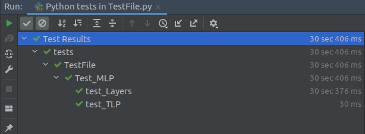
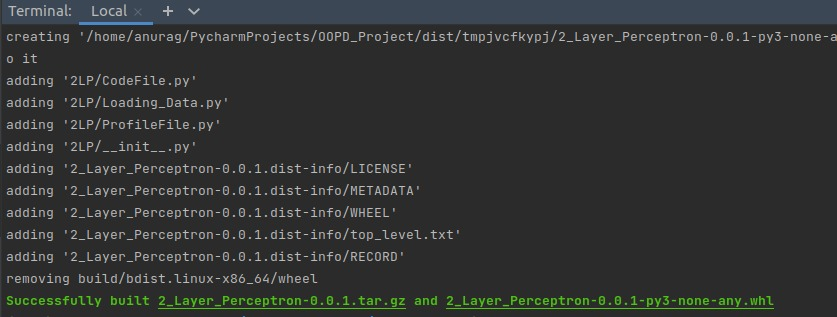

# **MultiLayer Perceptron - A Two Layer Neural Network**

## **Introduction**
Multilayer Perceptron is a deep learning model which used weights to find patterns in complicated data.

Input data is fed to a layer which has many nodes. Each node uses it's weights and biases to calcluate a value with respect to the inputs and then apply a non-linear function to the value calculated. These non-linear functions are called activation functions. In our case, we have used the relu and sigmoid funcitons. The outputs of one hidden layer is used as the input to the next hidden layer. Finally, the output of the last hidden layer is used as the input to the output layer, which in turn, gives the output we are seekin for. 

MLP uses a loss function to calculated the distance between the actual answer and the answer given by the model. In our case, we have used Squared-Loss loss function. The loss calculated is then used to update the weights of model such that the predicted answer by the model gets closer to the actual answer. This process of updation of weights to minimize the loss is called backpropagation.

Calculting the answers by the given weights of the model and then calculating loss using the actual answers is called forward propagation. Using forward and backward propagation together to help the model reach an optimal minima of loss such that it is accurate to cases it has not encountered during training is called Gradient Descent.

We have used one hidden layers and one output layer here. This results in a two layer neural network. Our model class is flexible and can be used to add any number of hidden layers as per requirement of the usecase. 

## **OOPS Concepts Used**
* **Classes and Objects**: To develop a 2-Layers perceptron we have used classes and objects for managing the different modules independently.A model class is used for the Model and its properties such as learning rate, A Layer class is used to maintain different types of layers.
* **Inheritance**: The concept of inheritance is used while creating different Layers from the **Layer Class** two subclasses LayerRelu and LayerSigmoid are created to reuse the cabability and properties of Layer class (Parent Class).Inheritance is also used in Database Connectivity.
* **Polymorphism**: Polymorphism is not supported in python hence this is not implemented in any of the classes.Only method overriding is done in database connectivity and Model creation.
* **Encapsulation**: Every attribute or data members of classes are made private and **getter and setter methods** of the required data members are created so that they can be only accessed by the member functions of that class only whenever needed.
* **Abstraction**:The actual implementation of the MLP is not visible to the user, the user only needs to call the already creating function to modify the capability as per the need such as the **add()** function of the model class to add the Layers to the model.

## **Requirements**
 * **Hardware** \
    A PC with a good Processor and a RAM or a Online Cloud Environment
 * **Software** \
    Python 3.3.6 must be installed on the system to run the MLP. \
    Numpy Library must be present in the Environment where the project needs to be executed.
    * Testing: 
      * unittest library must be present.
      * gc library must be present.
    * Profiling:
      * cProfile library must be present.
      * pstats library must be present.
      * wraps library must be present from functools.
    * Packaging:
      * latest version of 'pip' should be installed, if not run this 'python3 -m pip install --upgrade pip'
## **Working**
* **Database Connectivity** \
 There are 3 classes - 
  * **i) DataLoader**\
    Loads the data from MNSIT idx files using following methods 
    * load_testing(self): load_testing is used to load test images
    * load_training(self): load_testing is used to load test images
    * load(cls, path_img, path_lbl): load checks the magic number of files in paths *path_img, path_lbl
  * **ii)DatabaseLoader** 
    * inherits DataLoader 
    * Stores the data obtained from DataLoader into a database using the following methods
    * load_training(self): Method overriding done to return train images and labels 
    * load_testing(self): Method overriding done to return train images and labels    
    * create_table(self): Creates tables for train and test set    
    * save_result(self,y_pred): If prediction is not stored, creates a table and stores predictions[y_pred] \
  * **iii)DataFrameLoader**
    Loads data from database to dataframe using *load_dataframes(self)* function
* **Model** \
  Initially an object of TLP class is being made with a given learning rate. Layers are added to the model by creating an object of the ReluLayer or SigmoidLayer class (depending on which layer needs to be added). 
  
  Add function of the TLP class is used to add the layer to __layers private data member present in the TLP class. Fit function on the TLP class is used to store the data on which the model has to be trained in the private data members inpt and y of the TLP class. Then the compile function from the TLP class is called with the number of epochs. Compile function first initializes all the layers in the model by calling initializeLayer function for every layer in the __layers list and then it calls the gradientDescent function of the TLP class. 
  
  GradientDescent function takes in the number of epochs from the compile function, and for that many number of epochs it trains the model. For training the model, GradientDescent function first calls forwardPropagation function of TLP class with the first input instance, gets the expected output from the model, calculated the loss and it's derivative with respect to the output of the model, and uses this lossDerivative to call the backPropagation function of the TLP class. 
  
  The frontPropagation function takes in the input instance from GradientDescent function and then for every layer in __layers, it calls the frontStep function which takes in the input for that layer and outputs the a value which is calculated in the frontStep function using the weights, bias and activation function of the layer which are private data members and functions for the Layer class. The a value of the layer, which is the output given by the frontStep function of the layer is then used as the input to the front step function for the next layer.

  The a value for the output layer is used to calculate the loss and the lossDerivative using the y value which was stored in the TLP object initially using the fit function. Then backPropagation function of TLP class is called with lossDerivative as input. 

  BackPropagation funciton calls backStep function for every layer in __layers in the backwards order. BackStep function is a member function of the Layer class and it's child classes and it takes in derivativeA as input, for the output layer, derivativeA is the lossDerivative which is calculated inside GradientDescent function and then passed to the backPropagation function which inturn passes it to the backStep function of output layer. The backStep function changes the weights and the bias of the layer object for which it is called and it outputs the derivative for the layer before it using the private data members and member function of the layer objects. The output of backStep function of a layer is passed to the layer before it and the output of the input layer is discarded. 

  This completes one cycle for forward and backward propagation. This is done for every instance present in the input provided to the model in one epoch. After all the epochs are complete, the model is trained and is ready to be tested. 

  The frontStep and backStep functions use activation and derviativeActivation functions which are the private member function for the ReluLayer and SigmoidLayer classes. These functions are specific to the type of layer being used. For instance,  activation function for ReluLayer class take an input and applies the relu function on it whereas the  activation function for SigmoidLayer class take an input and applies the sigmoid function on it.

  Then the predict function of the TLP class is called, which takes an input having a list of instances and it calculates the output for those instances which is predicted by the model. This is done by using forwardPropagation function for all the instances. 

* **Testing** 
  * **setUpClass():** we have loaded the data (i.e X and y) for further processing
  * **tearDownClass():** we have removed the memory allocated to X and y.
  * **setUp():** we have trained our model.
  * **tearDown():** we have removed the memory allocated to the model.
  * **test_TLP():** checks the functionality of TLP class.
  * **test_Layers():** method checks the functionality of Layers class.

* **Profiling** 
  * **profile(output_file=None, sort_by='cumulative', lines_to_print=None, strip_dirs=False):** is the boilerplate code for performing profiling on any segment of code.
  * **profiling_info(X, y):** this method is annotated with @Profile() and is the function on which profiling is done.
  
* **Packaging** 
  * We have created 'pyproject.toml' file for doing packaging of the project.
  * We have created 'setup.cfg' file.
  * We have created 'LICENSE' file.
	
## **Databases**
* **Sqlite** \
	A database DigitPrediction.db has been created for the purpose.
## **Testing**
* **Unit Testing** \
    We have used 'unittest' module for performing unit testing on the project. One can refer [this](https://docs.python.org/3/library/unittest.html) for better understanding of 'unittest'.
  
## **Profiling**
* **cProfile, pstats, wraps** \
    We have used 'cProfile', 'pstats' and 'wraps' for performing profiling on the project. One can refer [this](https://docs.python.org/3/library/profile.html) for better understanding of profiling.
## **Packaging**
* One can better understand how to make .whl file from [here](https://packaging.python.org/tutorials/packaging-projects/)

## **Running Instructions**
* **Training and Testing the Model**
  * Go to OOPD_Project --> src --> 2LP --> CodeFile.py
  * Run CodeFile.py file 
* **Testing**
  * Go to OOPD_Project --> src --> 2LP --> TestFile.py
  * Run TestFile.py file 
* **Profiling** 
  * Go to OOPD_Project --> src --> 2LP --> ProfileFile.py
  * Run ProfileFile.py file
* **Packaging** 
  * Run 'python3 -m build' command in terminal in the same location where pyproject.toml, setup.cfg and LICENSE files are present. 
## **Results**
* **Testing** \

* **Profiling** \
Profiling_Info.txt file is created which is having all profiling information.
* **Packaging** \
Packaging File is  created \

* **Accuracy** \
The accuracy on the test dataset is 40% with 100 epochs which is a good score with a two layer perceptron with 5 nodes in hidden layer.
